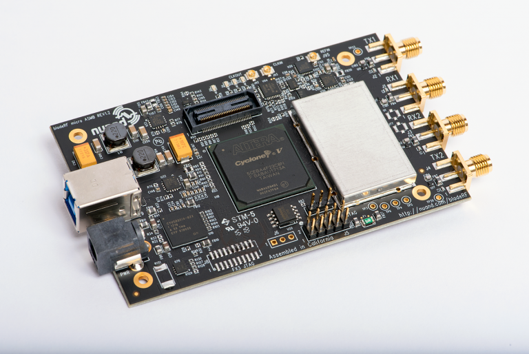
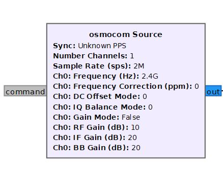

## NUAND BladeRF 

## Documentacion util:
- [Blade rf v2](https://www.nuand.com/bladerf-2-0-micro/)
- [gitHub Nuand Blade](https://github.com/Nuand/bladeRF)
- [bladeRF Product Brief](https://www.nuand.com/bladeRF-brief.pdf)
- [libbladeRF API documentation](https://www.nuand.com/bladeRF-doc/libbladeRF/v2.2.1/)
- [An SDR-Based FRS Transceiver view](https://www.nuand.com/bladeRF-doc/examples/bladeRF_frs.html)
- [wiki bladeRf](https://github.com/Nuand/bladeRF/wiki)

## gnuradio osmocom

[Install gnuradio](https://www.gnuradio.org/news/2021-06-10-gnu-radio-v3.9.2.0-release)

## Matlab

- [Configuration](https://github.com/sequeirandres/BladeRFv2Ax4/blob/main/BladeRFv2Ax4/bladeMatlab.m)
- [Tx example](https://github.com/sequeirandres/BladeRFv2Ax4/blob/main/BladeRFv2Ax4/tx_example_bladeRF.m)
- [Rx example](https://github.com/sequeirandres/BladeRFv2Ax4/blob/main/BladeRFv2Ax4/rx_example_bladeRF.m)

## Bladerf cli -i

## Python

